# ComfyUI Comic Creator

**日本語** | [English](README_en.md) | [中文](README_zh.md)

ComfyUI 上で動作するマンガページ作成 SPA（シングルページアプリケーション）です。作品（ページグループ）単位でページを管理し、テンプレートからページを作成してコマに画像・フキダシ・テキスト・図形・3D ポーズを配置し、JPEG/PNG/WebP/PDF/EPUB 形式で出力できます。レイヤーベースの画像エディタ、フォント管理、AI 画像生成（Nanobanana）、脚本管理まで、マンガ制作に必要な作業をこのノード一つで完結することを目的としています。

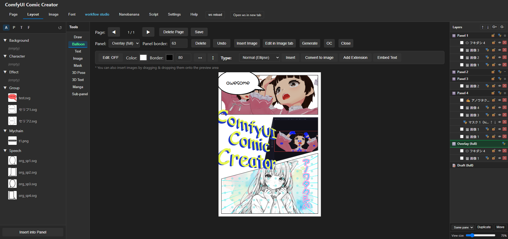

## 主な機能

### ページ・作品管理

- **作品（ページグループ）単位の管理** — 幅・高さを持つ「作品」でページをまとめて管理。テンプレート挿入時に作品サイズへ自動リサイズ
- **テンプレート機能** — SVG インポートまたはウィザード（線を引いてコマを分割）でコマ割りテンプレートを作成・登録。テンプレートグループを作成しておくと、レイアウトタブのアセットパネル「テンプレート」タブで折りたたみ可能なグループ表示になり、テンプレート数が増えても目的のものを探しやすい
- **出力** — JPEG/PNG/WebP/PDF/EPUB 形式で出力。複数ページの一括出力・連番ファイル名にも対応。ライブラリ（jsPDF/JSZip）は同梱のため全形式がオフラインでも出力可
- **解像度指定の出力サイズ自動計算** — 「解像度」セレクト（72〜600dpi）で作品サイズ（mm）から出力 px 値を自動計算（手動入力も可）。PDF は選択 dpi で換算され物理サイズ（A4 等）が維持される
- **出力メタデータ** — タイトル・著者・件名・キーワードを全形式に埋め込み（PDF=文書プロパティ / EPUB=Dublin Core / PNG=iTXt / JPEG・WebP=XMP）。解像度（dpi）も PNG=pHYs / JPEG=JFIF density / WebP=EXIF として常に埋め込まれ、3 形式で表示 dpi が一致する
- **一括バックアップ／復元** — 全作品・ページ・テンプレート・設定を 1 つの zip に保存し、いつでも復元（同名は上書きのマージ方式）

### レイアウトタブ

- **画像配置** — ドラッグ＆ドロップでコマに画像を挿入。ハンドルでリサイズ（通常は縦横比固定、Alt＋ドラッグで固定解除の自由変形）・回転。ツールバーの**削除**ボタンは画像に限らず、選択中のオブジェクト（フキダシ・テキスト・図形・グループも含む）を削除できる（Delete/Backspaceキーと同じ動作）
- **サブコマ** — コマの中に矩形・丸のサブコマ（別カットの画像挿入先）をドラッグで追加。ハンドルで移動・リサイズ・回転でき、親コマの外へはみ出した部分は通常のオブジェクトと同じく自動でクロップ。枠線の太さはサブコマごとに個別設定可能。レイヤーパネルの「サブコマ操作」チェックボックスで、中のオブジェクトより優先してサブコマ自体を選択・移動するモードに切替できる。レイヤーパネル下部の複製・移動ボタンでサブコマ自体を他のコマやオーバーレイへ複製・移動（親コマの付け替え）することも可能
- **フキダシ** — 楕円・角丸矩形・思考・バクダン・雲（もこもこ／なみなみ）の形状をコマ内に配置。8 点リサイズハンドル対応。**尻尾なし**チェックボックスで尻尾の長さを0にして非表示にできる（OFFに戻すと直前の長さに復元）。**テキストを内包**ボタンで、いずれの形状にもテキストを自動折返しで内包（縦書き対応、文字色、文字寄せとは独立した上下/左右の配置調整、Google/システム/カテゴリのフォント選択、既存の内包テキストはダブルクリックで再編集）。アセットのカスタムSVGフキダシも配置後に塗り色・枠色を変更可能
- **延長フキダシ** — Comic Life の「延長フキダシ」を参考にした機能。**延長を追加**ボタンで、選択中のフキダシと同じ形状・色のフキダシをネック（連結部分）でつないで追加でき、長いセリフを複数のフキダシに分けて配置できる。延長は個別に位置・大きさ・回転・内包テキストを編集可能。ベースを動かすと延長も一緒に平行移動（ベースのリサイズ・回転は延長の位置に影響しない）、延長を動かすとネックだけが伸縮。尻尾をベースから延長側へドラッグすると連結全体の外周まで届かせられる。フキダシ同士が重なっても内部に線は出ず、連結全体の外周だけが表示される
- **テキスト** — 縦書き・横書き、Google Fonts / システムフォント、塗り・線・袋文字・影を設定できるスタイルモーダル。塗りは単色に加えグラデーション・テクスチャ（位置 X/Y 指定可）・塗りなしに対応（レイアウト/Image タブ共通）
- **形状描画（ドロー）** — 矩形・楕円・直線・曲線・多角形・ベクター曲線・鎖・ロープ・My 曲線を SVG レイヤーに直接描画。多角形はクリックで頂点追加＋始点付近クリックで確定、ベクター曲線はクリックでノード追加してなめらかな曲線（スプライン）で結び、始点付近クリックで閉じたシェイプ、Enter キーで開いた線として確定。塗り（矩形・楕円・多角形・ベクター曲線等）は単色に加えグラデーション・テクスチャ（位置 X/Y 指定可、シェイプの移動・リサイズに追従）・塗りなしに対応。図形の PNG 変換もこれらの塗りをそのまま反映
- **ペイントツール** — 形状描画（ドロー）とは別系統のラスターブラシ機能。「ペイントを追加」ボタンで選択中のコマ／オーバーレイ／下書きレイヤーのサイズにぴったり合わせた画像を自動生成・選択し、そのまま描画 ON でブラシ描画を開始できる（左隣の「背景色」チェックボックスをONにすると指定色の不透明画像として作成でき、透過のままI2Iへ送ると背景が黒くなる問題を回避可能）。ブラシは新規ペイントオブジェクトだけでなく選択中の通常画像にも直接描き込める。ブラシ色・不透明度・サイズ（スライダー）に加え、x5（ブラシサイズ 5 倍）・消しゴムの ON/OFF をボタンの色で明示するトグルに対応。レイヤーパネルには 🖌 アイコン・「ペイント」の名前で表示され通常画像と区別できる。「選択画像を統合」ボタンでレイヤーパネルのチェックボックスで選んだ画像・ペイントレイヤー（2枚以上）を重ね順・回転を保ったまま1枚のPNGへ合成でき、I2Iに複数レイヤーをまとめて送りたい場合に活用できる。Image タブでの下描き・I2I 参照画像の作成などに活用可能
- **3D ポーズ** — VRM/GLB/GLTF モデルをコマ内に配置してポーズを付け画像に焼き込み。視線ターゲット追従・揺れボーン物理・そよ風エフェクト（発生源マーカーで向き指定）にも対応（[comfyui-vrm-pose-editor](#依存関係任意) 連携）
- **3D テキスト** — 日本語を含むテキストを Three.js で立体的に押し出して画像に焼き込み。TrueType Collection（.ttc、游ゴシック・メイリオ等の Windows 標準 CJK フォント）にも対応。マテリアルは標準（金属・粗さ）／トゥーン（MToon 互換シェーディング）から選択可能。**⚙ 設定**モーダルでマテリアル・ライト（環境光／メインライト／フィルライトの色・強度・位置）・カメラ（ズーム操作モード・アンチエイリアス強化）をまとめて調整でき、実描画中のプレビューをモーダル内に直接埋め込んで確認しながら編集できる。ズーム操作モードとアンチエイリアス強化は 3D ポーズのライトエディタと設定を共有（[comfyui-vrm-pose-editor](#依存関係任意) 連携）
- **グループ機能・レイヤーパネル** — オブジェクトのグループ化、重ね順、表示切替、ロック、**Delete / Backspace キーでの削除**
- **下書きレイヤー** — オーバーレイのさらに前面・ページ全体を覆う下書き専用レイヤー（画像のみ）。選択中（編集モード）のときだけプレビュー上でクリック・ドラッグ操作でき、それ以外は下のオーバーレイ／コマ／オブジェクトへクリックが透過。出力（JPEG/PNG/WebP/PDF/EPUB）には一切含まれない。Image タブの「下書き」ボタンで作品と同じ縦横比・72dpi 換算のキャンバスを作成し、「レイアウトに送る」で自動的にこのレイヤーへページ全面サイズで挿入される
- **I2I 連携** — 「I2I」ボタンから、選択画像または現在のページ全体を対象に切り替え可能なモーダルを開き、Positive/Negative プロンプト・Denoise を設定してその場で Workflow Studio へ送信・生成を実行できる（結果は選択画像対象なら選択中のコマ／オーバーレイ／下書きへ、ページ全体対象は常にオーバーレイへページ全面サイズで新規画像として挿入）。デフォルトワークフローの自動読み込みはモーダル内および Image タブの Select ツール内 I2I パネルで指定可能（共有設定、[ComfyUI-Workflow-Studio](#依存関係任意) 連携）
- **PixiJS FX** — 「画像」サブタブから選択画像にパーティクル・フィルタ効果を適用（[comfyUI-particle-pixijs](#依存関係任意) 連携）
- **マンガツール** — 「ハーフトーン」（選択画像を網点変換する「画像を変換」、コマ/オーバーレイサイズの網点パターンのみ生成する「パターンを作成」の2モード）、「マンガ効果」（ヴィネット・スクリーントーンノイズ・集中線（放射状／ウニフラ／ウニ（輪）／線形の4種）をコマサイズの透過オブジェクトとして生成・挿入）、「背景パターン」（ストライプ・ドット・チェック・和柄（麻の葉／市松／七宝／鱗）・カスタムSVGをコマサイズの透過オブジェクトとして生成。色・不透明度・サイズ・回転角度を指定でき、カスタムSVGは幅・高さを個別指定可能）の3モーダルを搭載。いずれも選択画像／デフォルト／白でプレビュー背景を切り替えて確認しながら調整可能

### Image タブ（レイヤーベース Canvas 2D エディタ）

- **Select / Text / 3D Text / Draw / Shape / Fill / Mask / Blur / Filter / BG Remove / Upscale** の各ツール（3D Text はレイアウトタブと同じエンジン・設定モーダルを共有、[comfyui-vrm-pose-editor](#依存関係任意) 連携）
- **Select ツールのクロップ** — ドラッグ可能な範囲オーバーレイ（8 ハンドル）または X/Y/幅/高さの数値入力でクロップ範囲を指定し実行。キャンバス全体をリサイズし、各レイヤーは中身を保ったまま位置をシフト（Undo 対応）
- **Select I2I** — Select ツール選択中は常時表示される I2I パネルから、Positive/Negative プロンプト・Denoise を設定して Run するだけで Workflow Studio 連携の I2I 生成をその場で実行できる。対象は「All」（全レイヤー合成）／「Layer」（選択中レイヤー単体）を切替可能で、結果は元レイヤーの位置・サイズ・回転を引き継いだ新規レイヤーとして追加される（[ComfyUI-Workflow-Studio](#依存関係任意) 連携）
- **下書きキャンバス作成** — 「下書き」ボタン（New の右隣）で、サイズ入力ダイアログなしに、作業中の作品と同じ縦横比・72dpi 換算サイズのキャンバスを新規作成（ラフスケッチ用途）。「レイアウトに送る」でレイアウトタブの下書きレイヤーへページ全面サイズで挿入される
- **Draw ツールのスポイト** — カラーピッカー横のボタンでキャンバス上の色を直接ブラシカラーに設定
- **Shape ツールの Same Layer モード** — 図形を描くたびに新規レイヤーを作らず、同じレイヤーに重ね描き。矩形・楕円の塗りは単色に加えグラデーション・テクスチャ（位置 X/Y 指定可）に対応
- **Fill ツール** — 単色塗り／線形・円形グラデーション塗り（カラーランプ・方向パッド）
- **Mask ツール** — Paint/Color/Alpha/Text/Vector/Shape の各サブツール、SAM3 セグメンテーション・ABR ブラシにも対応（[comfyui-mask-editor-one](#acknowledgements) のツール構成を参考に実装）。Workflow Studio 導入時はサブツールバーに **Inpaint** ボタンが追加され、マスク＋プロンプトによる生成 AI での部分修正が行える（[ComfyUI-Workflow-Studio](#依存関係任意) 連携）
- **PixiJS FX** — ツールバーのボタンからアクティブレイヤーにパーティクル・フィルタ効果を適用（[comfyUI-particle-pixijs](#依存関係任意) 連携）
- **レイヤーパネル** — 追加・複製・削除・重ね順変更・不透明度・調整レイヤー（明度/コントラスト/彩度など 12 種）。複数選択時は「統合」で選択レイヤーのみを1枚に統合（マスクレイヤー同士の統合結果もマスクレイヤーとして維持）。上部メニュー2行目の「📁 グループ」ボタンで、複数選択したレイヤーを折りたたみ可能なフォルダにまとめられる（一括表示切替・解除に対応、Undo 可）
- **プロジェクト保存** — レイヤー構成をまるごと保存し、いつでも再編集を再開可能

### フォント管理

- Google Fonts・システムフォントのプレビュー、カテゴリ管理
- 塗り・線・袋文字・影をまとめた「スタイル」と、フォント＋サイズ＋スタイルの「プリセット」を作成・保存し、レイアウト/Image タブから即座に呼び出し

### Nanobanana（AI 画像生成）

- Gemini API を使った画像生成（Positive/Negative プロンプト・モデル・解像度指定）
- 生成画像は ComfyUI 本体の `output/cc_nanobanana` フォルダへ自動保存

### スクリプトタブ

- 作品名 → あらすじ → プロット［ページ → コマワリ（シーン・画像プロンプト・要素・セリフ/説明等）］の階層構造で脚本を管理
- コマワリの内容をワンクリックでレイアウトタブのテキストとして挿入
- **メディア種別（漫画/半自動マンガ/小説/脚本）** — 作品ごとに固定のメディア種別を切り替えられるサブタブ基盤。「漫画」「半自動マンガ」は同じコマ割り編集画面を共有しつつ作品データは独立（小説・脚本は今後追加予定）
- **半自動マンガ作成** — 「このページをレイアウトに流し込む」ボタンで、レイアウトタブのテンプレート適用済みページとスクリプトのコマをパネル番号順に対応付け。「コマ数取得」ボタンでレイアウトタブの選択中ページの実際のコマ数に合わせられる（データ入りコマを消す場合は確認ダイアログ）。プロットにセリフ行ごとの「フキダシ形状」ドロップダウン（既定/通常/角丸矩形/思考/バクダン/雲もこもこ/雲なみなみ）があり、「フキダシを自動生成」ボタンで対応付け結果をもとに指定形状（既定は角丸矩形）のフキダシをコマ内に自動生成（生成後は既存の手動編集機能で調整可能）。「L」ボタン・「画像を一括生成」ボタンでWorkflow Studio連携によるプロンプト下書き（Ollama/LM Studio）・コマのアスペクト比に応じたバッチ画像生成（T2I）に対応。「画像を一括生成（I2I）」ボタンでは、コマの現在の画像を入力にレイアウトタブのI2Iモーダル同等の専用モーダル（全体Positive/Negative＋コマごとのプロンプト結合、空プロンプトのコマをスルーするか選択可）からバッチI2I生成が行える。「画像を一括生成（Nanobanana）」ボタンでは、Workflow Studioの代わりにNanobanana（Gemini画像生成API）を使い、コマのbboxアスペクト比に近いNanobanana解像度プリセットを自動選択・スケール調整して挿入するバッチI2I生成が行える（モデル選択・2K生成トグル付き、生成画像はEagle自動保存設定と連動）。Nanobananaタブにも同じ「2K」トグルを追加（Gemini APIのImageConfig.imageSize指定、対応モデルのみ）。なお、Gemini画像生成APIにI2Iの変化度合いを数値指定するパラメータは存在しないため、既存のI2I強度スライダーはNanobananaタブ・半自動マンガの両モーダルから削除した

### 外部連携

- **Workflow Studio** — ギャラリーの埋め込み表示、I2I（画像→ワークフロー）双方向送受信
- **Eagle** — 生成・編集した画像を Eagle へ自動／手動保存
- **G'MIC** — G'MIC Qt GUI と連携したフィルタ編集

### その他

- **多言語 UI（i18n）** — 日本語・英語・中国語を設定タブで切り替え（ヘルプタブの全解説も 3 言語対応）
- **ヘルプタブ** — 全機能を網羅した検索可能なリファレンス

## インストール

### 手動インストール

ComfyUI の `custom_nodes/` 配下にこのフォルダを配置してください。

```
ComfyUI/
└── custom_nodes/
    └── comfyui-comic-creator/
        ├── __init__.py
        ├── py/
        ├── templates/
        ├── static/
        ├── web/
        └── assets/
```

このノードは追加の Python パッケージを必要としません（`aiohttp` / `Pillow` は ComfyUI 本体に同梱済み）。`requirements.txt` は不要です。

ComfyUI を再起動すると、トップバーに **CC** ボタンが追加されます。クリックすると新しいタブで Comic Creator（`/ccc`）が開きます。

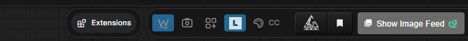

### ComfyUI Manager

ComfyUI Manager の「Install via Git URL」から以下の URL を入力してインストールできます：

```
https://github.com/ketle-man/comfyui-comic-creator
```

## 任意設定

### Nanobanana（Gemini API）を使う場合

このフォルダ直下に `.env` ファイルを作成し、Gemini API キーを記載してください。

```
NANOBANANA_API_KEY=あなたのAPIキー
```

設定後は ComfyUI の再起動が必要です。

### G'MIC を使う場合

設定タブの「G'MIC設定」で、G'MIC Qt 実行ファイル（`gmic_qt.exe`）のフルパスを指定してください。保存後すぐに反映され、ComfyUI の再起動は不要です。

### Eagle 連携を使う場合

設定タブの「Eagle設定」で Eagle の API URL（デフォルト: `http://localhost:41595`）を確認・変更できます。Eagle アプリが起動している必要があります。

### 依存関係（任意）

以下のカスタムノードがインストールされていると、対応する機能が有効になります。未インストールでも他の機能には影響しません。

| 連携先                            | 有効になる機能                                     |
| --------------------------------- | -------------------------------------------------- |
| **comfyui-vrm-pose-editor** | レイアウトタブ・Image タブの 3D ポーズ／3D テキスト           |
| **ComfyUI-Workflow-Studio** | I2I 連携、Image タブの Inpaint、workflow studio タブのギャラリー埋め込み |
| **comfyUI-particle-pixijs** | レイアウトタブ「画像」サブタブ・Image タブの PixiJS FX（パーティクル／フィルタ効果モーダル） |

## 使い方

1. トップバーの **CC** ボタンから Comic Creator を開く
2. 「ページ」タブの「作品管理」で作品名とサイズを入力して「新規作成」（レイアウトタブへ自動遷移）
3. レイアウトタブ左のアセットパネル「テンプレート」からテンプレートを選び「ページとして挿入」
4. コマに画像・フキダシ・テキストを配置して編集し、「保存」
5. ◀▶ のページ送りとテンプレート挿入を繰り返して複数ページを作成
6. 「ページ」タブの「出力」で形式・範囲を指定して保存

詳しい使い方はアプリ内の「ヘルプ」タブ（日本語・英語・中国語対応、検索機能あり）を参照してください。

## スクリーンショット

<p>
  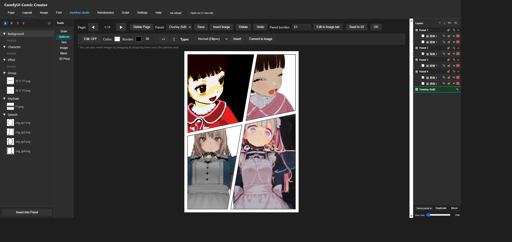
  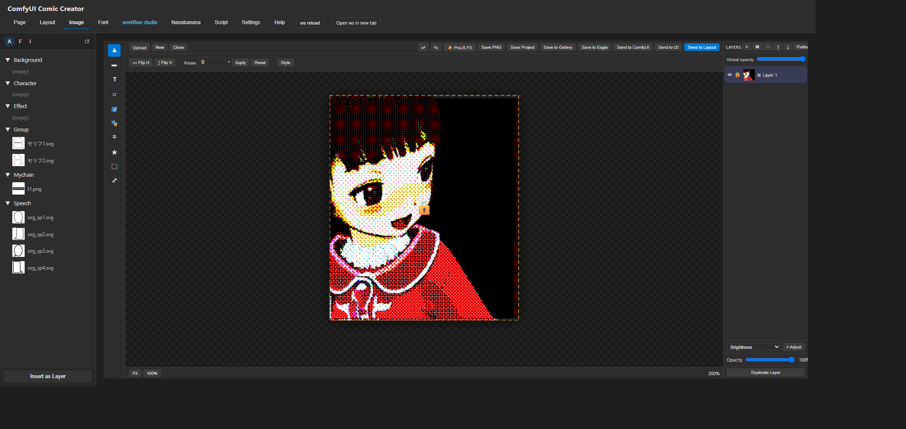
  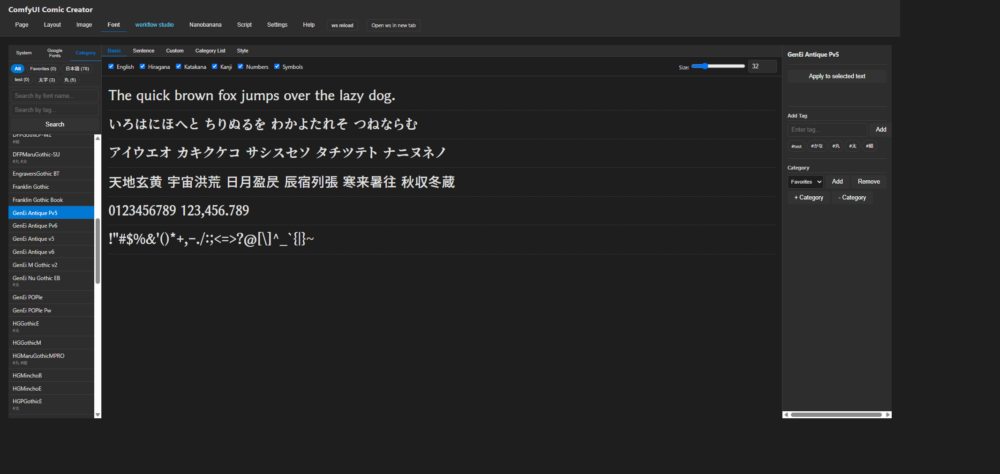
</p>
<p>
  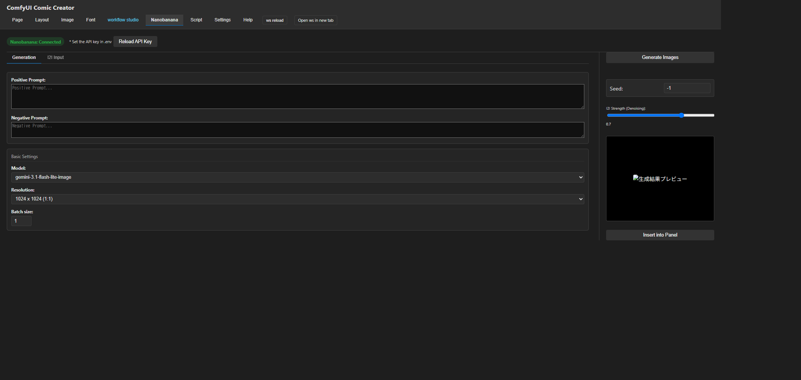
  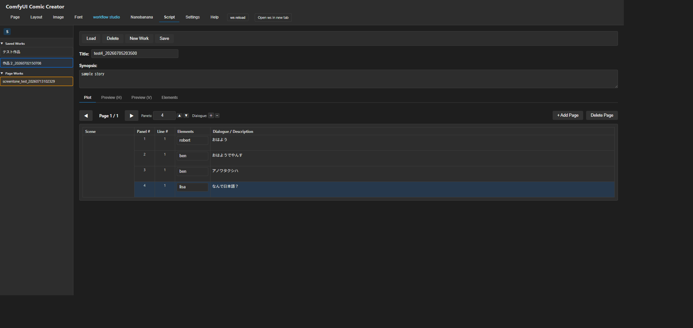
  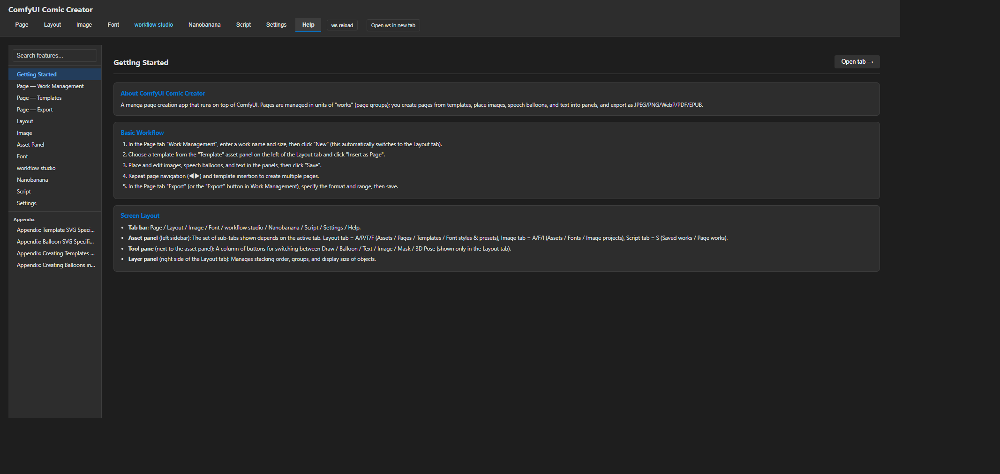
</p>
<p>
  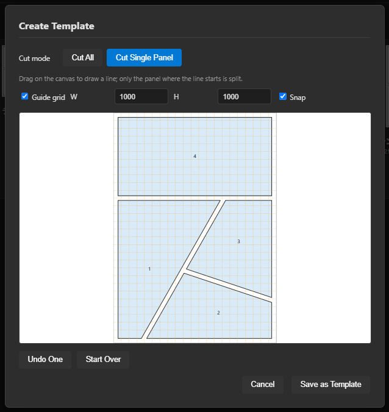
  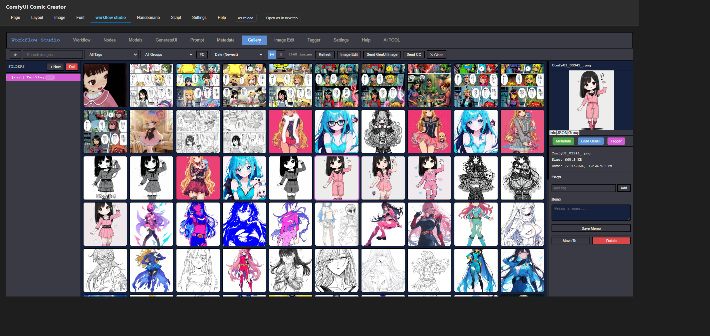
</p>
<p>
  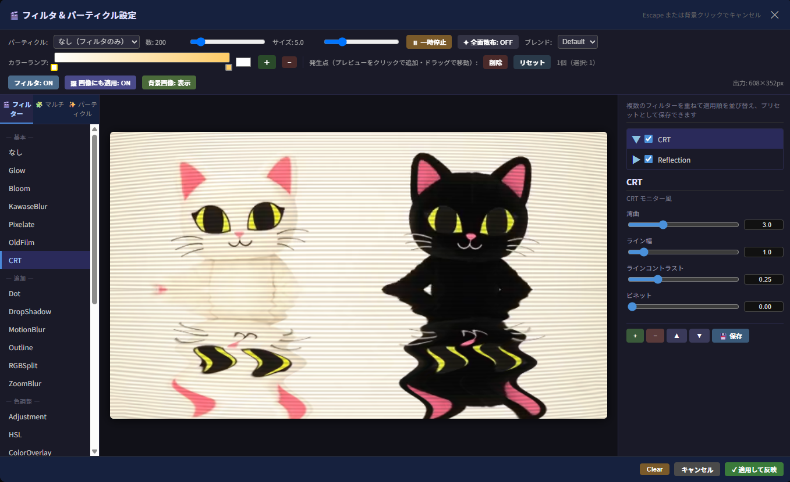
  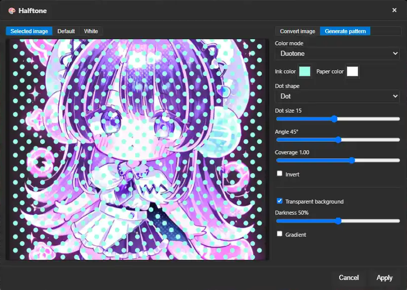
</p>
<p>
  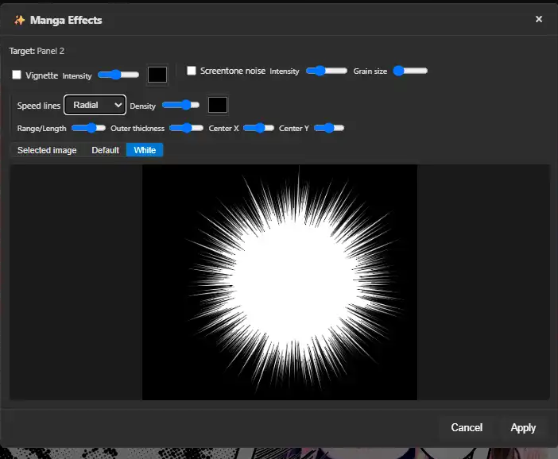
  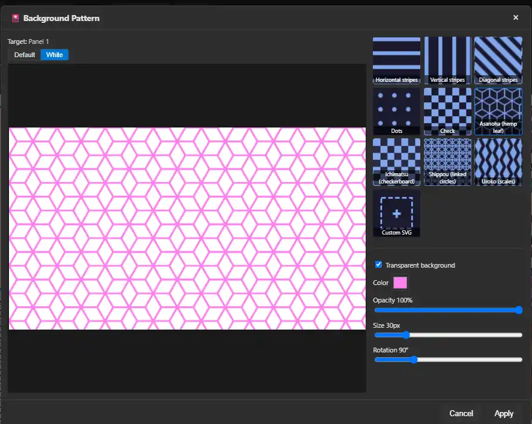
</p>
<p>
  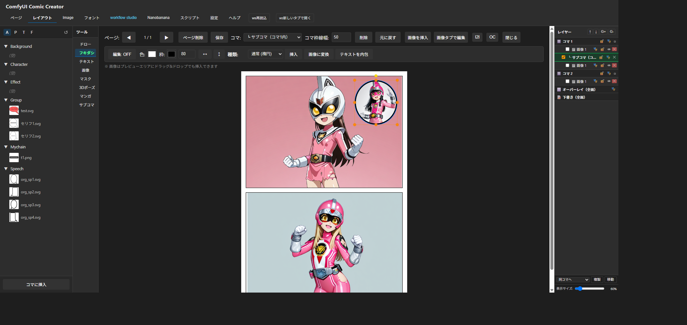
</p>

## アーキテクチャ

```
comfyui-comic-creator/
├── __init__.py              # ComfyUI拡張エントリ（WEB_DIRECTORY, ルート登録）
├── py/
│   ├── ccc.py                # aiohttp ルートハンドラ本体
│   └── config.py             # パス・定数定義
├── templates/
│   └── index.html            # SPA本体（静的HTML、data-i18n属性付き）
├── static/
│   ├── js/
│   │   ├── main/              # main.js分割ファイル群（状態管理・各タブロジック）
│   │   ├── image-tab.js       # Imageタブ コントローラ
│   │   ├── image-tab/         # Imageタブ専用ツール（DrawTool/ShapeTool/FillTool/MaskTool 等）
│   │   ├── i18n.js            # 多言語辞書（ja/en/zh）+ t()
│   │   ├── nanobanana.js      # Nanobanana（Gemini API）連携
│   │   ├── pixifx.js          # PixiJS FX連携
│   │   └── vendor/            # 同梱ライブラリ（jsPDF/JSZip、オフライン対応）
│   └── css/
├── web/comfyui/
│   └── ccc_menu.js            # ComfyUIトップバーへの起動ボタン登録
├── assets/                    # 同梱テンプレート・フキダシ・素材フォルダ
└── docs/                      # README用スクリーンショット
```

### API エンドポイント（抜粋）

| メソッド | パス                                    | 用途                         |
| -------- | --------------------------------------- | ---------------------------- |
| GET      | `/ccc`                                | SPA エントリポイント         |
| GET      | `/api/ccc/refresh-assets`             | アセット一覧の再生成         |
| POST     | `/api/ccc/nanobanana/generate`        | Nanobanana 画像生成          |
| POST     | `/api/ccc/save-image-project`         | Image タブのプロジェクト保存 |
| POST     | `/api/ccc/eagle/add`                  | Eagle への画像保存           |
| POST     | `/api/ccc/local-gmic/open_in_gui_b64` | G'MIC Qt GUI 起動            |
| GET      | `/api/ccc/local-gmic/status/{job_id}` | G'MIC ジョブ状態取得         |

## ライセンス

MIT License — 詳細は [LICENSE](LICENSE) を参照。

## Acknowledgements

- **[comfyui-vrm-pose-editor](https://github.com/ketle-man/comfyui-vrm-pose-editor)** — 3D ポーズ編集機能、および 3D テキスト機能が利用する Three.js 関連リソース（レンダラー・MToon マテリアル等）を提供するコンパニオンノード
- **[ComfyUI-Workflow-Studio](https://github.com/ketle-man/ComfyUI-Workflow-Studio)** — I2I 連携・ギャラリー埋め込み機能を提供するコンパニオンノード
- **[comfyUI-particle-pixijs](https://github.com/ketle-man/comfyUI-particle-pixijs)** — PixiJS FX（パーティクル・フィルタ効果）機能を提供するコンパニオンノード
- **[comfyui-mask-editor-one](https://github.com/ketle-man/comfyui-mask-editor-one)** — Image タブの Mask ツール・レイヤー機構の実装時に参考にしたノード
- [G&#39;MIC](https://gmic.eu/) — フィルタ編集機能（G'MIC Qt GUI、外部実行ファイル連携）
