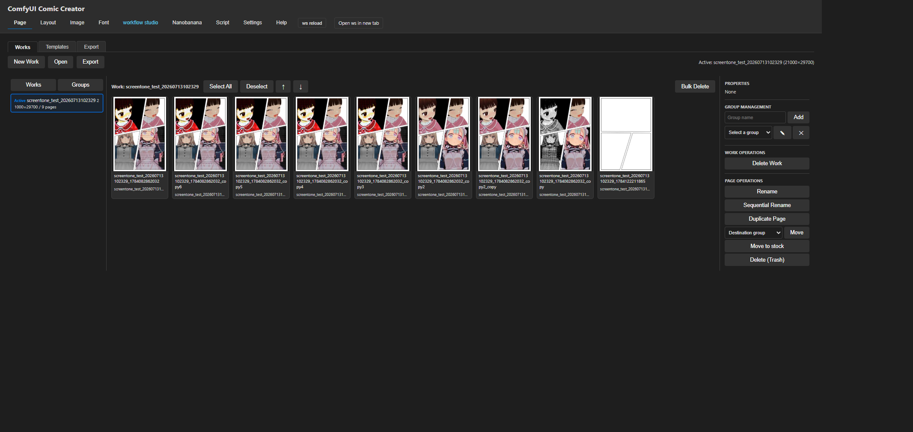
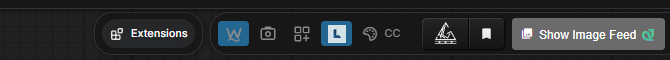
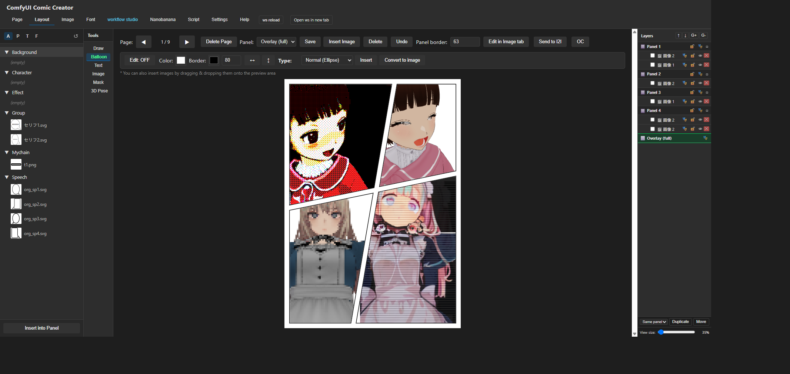
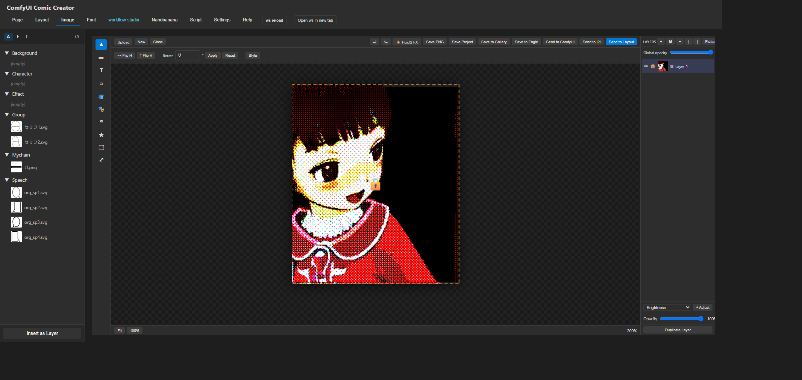
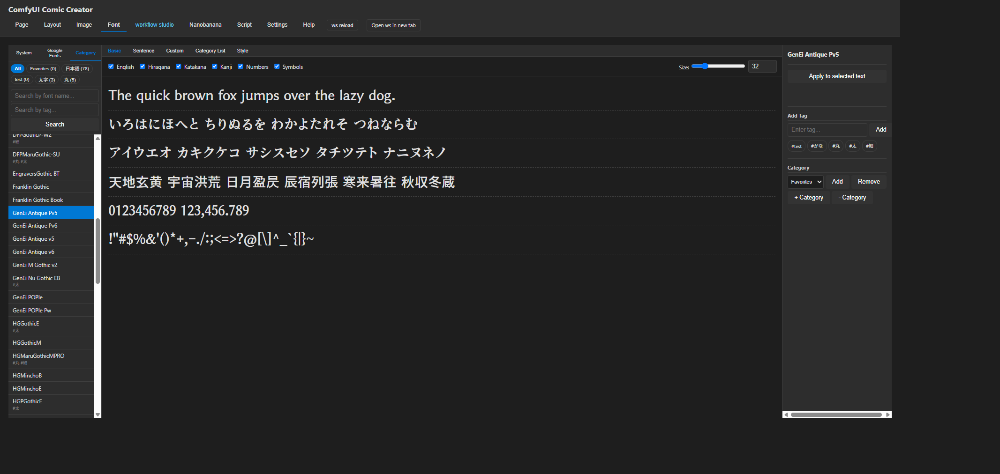
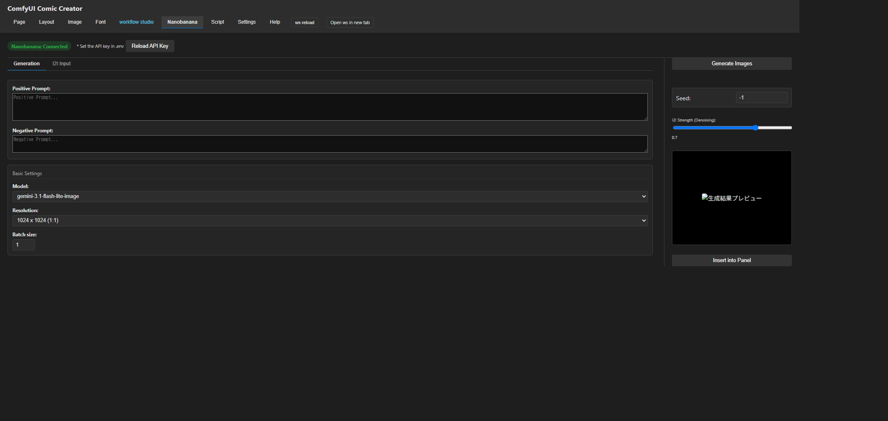
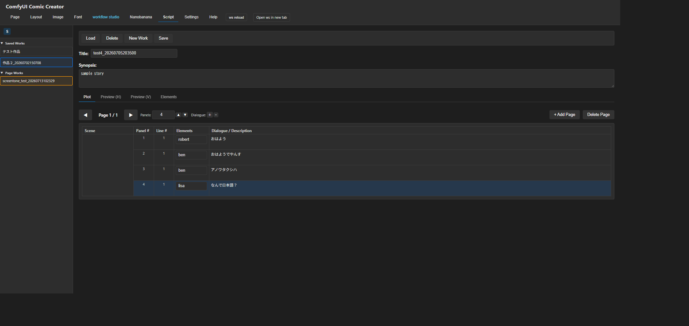
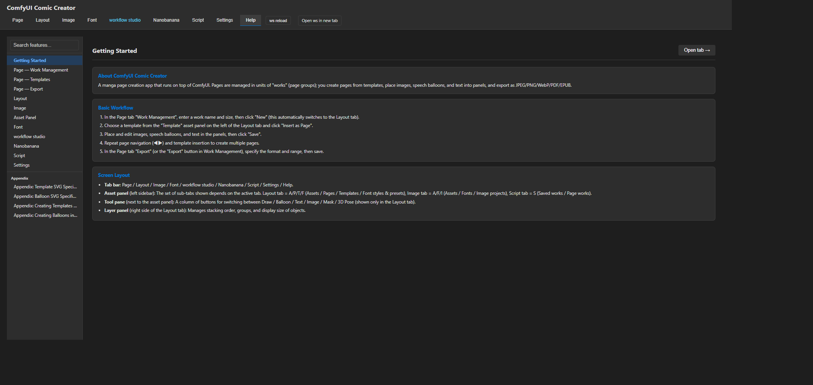
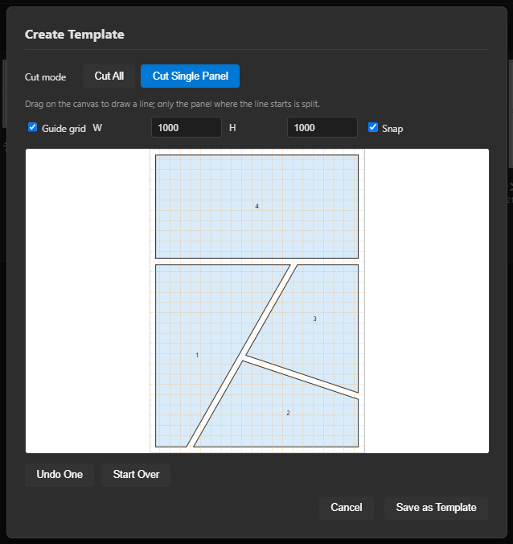
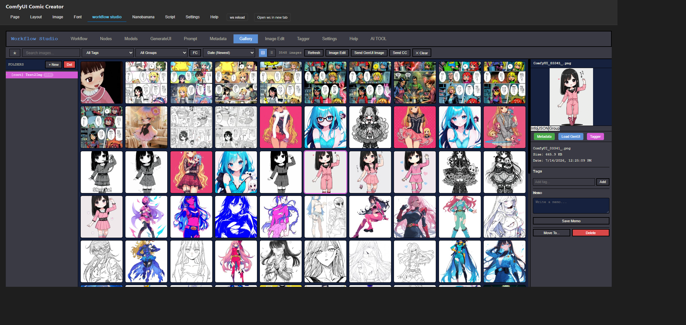

# ComfyUI Comic Creator

**English** | [日本語](README.md) | [中文](README_zh.md)

A manga page creation SPA (single-page application) that runs on top of ComfyUI. Pages are managed in units of "works" (page groups); you create pages from templates, place images, speech balloons, text, shapes, and 3D poses into panels, and export as JPEG/PNG/WebP/PDF/EPUB. A layer-based image editor, font manager, AI image generation (Nanobanana), and script management are all built in, aiming to cover the entire manga-making workflow from a single node.



## Features

### Page / Work management
- **Work (page group) management** — Pages are grouped into "works" that carry a width/height. Templates are automatically resized to the work's size when inserted
- **Templates** — Create panel-layout templates either by importing an SVG or with the wizard (draw lines to split the page into panels)
- **Export** — Export as JPEG/PNG/WebP/PDF/EPUB, including bulk export of multiple pages with sequential filenames. The libraries (jsPDF/JSZip) are bundled, so every format also works offline
- **Automatic output size via resolution** — The "Resolution" selector (72–600dpi) calculates the output pixel size from the work size (mm); manual input is still available. PDF conversion uses the selected dpi, preserving the physical page size (A4, etc.)
- **Export metadata** — Embed title, author, subject, and keywords into every format (PDF = document properties / EPUB = Dublin Core / PNG = iTXt / JPEG & WebP = XMP). Resolution (dpi) is also always embedded (PNG = pHYs / JPEG = JFIF density / WebP = EXIF), so all three formats report the same dpi
- **Bulk backup / restore** — Save all works, pages, templates, and settings into a single zip and restore anytime (merge mode: same names are overwritten)

### Layout tab
- **Image placement** — Drag and drop images into panels; resize (aspect ratio locked by default, hold Alt to resize freely) and rotate with handles
- **Speech balloons** — Place oval, rounded-rectangle, thought, burst, and cloud (puffy/wavy) shaped balloons inside panels, with 8-point resize handles. The **Embed Text** button lets you auto-wrap and embed text into any of these shapes (vertical writing, text color, Google/System/Category font selection, and double-click to re-edit an already-embedded text). Custom SVG balloons from assets can also have their fill/border colors changed after placement
- **Text** — Vertical/horizontal writing, Google Fonts / system fonts, a style modal for fill, stroke, outline, and shadow. Fills support gradients, textures, and no-fill in addition to solid colors (shared between the Layout and Image tabs)
- **Shape drawing (Draw)** — Draw rectangles, ellipses, lines, curves, polygons, vector curves, chains, ropes, and My Curve directly onto an SVG layer. Polygons: click to add vertices, click near the start point to close. Vector curves: click to add nodes connected by a smooth spline, click near the start point to close as a filled shape, or press Enter to commit as an open line. Fills (rectangles, ellipses, polygons, vector curves, etc.) support gradients, textures (with configurable X/Y offset that follows the shape when moved or resized), and no-fill in addition to solid colors. Converting a shape to PNG preserves these fills as well
- **3D pose** — Place a VRM/GLB/GLTF model inside a panel, pose it, and bake it into the image. Supports a draggable LookAt target and spring bone (hair/skirt) physics (via [comfyui-vrm-pose-editor](#optional-dependencies))
- **Groups and layer panel** — Group objects, manage stacking order, toggle visibility, lock, and **delete with the Delete / Backspace key**
- **Draft layer** — A draft-only layer that sits in front of the overlay and covers the whole page (images only). Clicks only reach it while it's selected (edit mode); otherwise clicks pass straight through to the overlay/panels/objects below. Never included in output (JPEG/PNG/WebP/PDF/EPUB). The Image tab's "Draft" button creates a canvas at the same aspect ratio as the active work at 72dpi, and "Send to Layout" automatically inserts it into this layer at full page size
- **I2I integration** — Send a selected image to Workflow Studio's Generate UI and bring the result back (via [ComfyUI-Workflow-Studio](#optional-dependencies))
- **PixiJS FX** — Apply particle/filter effects to the selected image from the "Image" sub-tab (via [comfyUI-particle-pixijs](#optional-dependencies))
- **Manga tool** — "Halftone" (an "Convert image" mode that halftones the selected image, plus a "Create pattern" mode that generates a halftone dot pattern sized to the panel/overlay) and "Manga effects" (generate and insert vignette, screentone noise, and speed lines — radial / uni flash / uni ring / linear — as transparent objects sized to the panel). Both modals let you switch the preview background between the selected image, a checkerboard, and white while adjusting

### Image tab (layer-based Canvas 2D editor)
- **Select / Text / Draw / Shape / Fill / Mask / Blur / Filter / BG Remove / Upscale** tools
- **Draft canvas creation** — The "Draft" button (next to New) creates a new canvas with no size dialog, sized at the same aspect ratio as the active work at 72dpi (for rough sketches). "Send to Layout" inserts it into the Layout tab's draft layer at full page size
- **Eyedropper for the Draw tool** — Pick a color directly from the canvas via the button next to the color picker
- **Same Layer mode for the Shape tool** — Keep adding shapes to the same layer instead of creating a new one for every shape. Rectangle/ellipse fills support gradients and textures in addition to solid colors
- **Fill tool** — Solid color fill, or linear/radial gradient fill with a color ramp and direction pad
- **Mask tool** — Paint/Color/Alpha/Text/Vector/Shape sub-tools, also supporting SAM3 segmentation and ABR brushes (tool set implemented with reference to [comfyui-mask-editor-one](#acknowledgements))
- **PixiJS FX** — Apply particle/filter effects to the active layer from a toolbar button (via [comfyUI-particle-pixijs](#optional-dependencies))
- **Layer panel** — Add, duplicate, delete, reorder, adjust opacity, and 12 kinds of adjustment layers (brightness, contrast, saturation, etc.)
- **Project saving** — Save the entire layer composition and resume editing at any time

### Font manager
- Preview Google Fonts and system fonts, with category management
- Create and save "Styles" (fill, stroke, outline, shadow) and "Presets" (font + size + style), and apply them instantly from the Layout / Image tabs

### Nanobanana (AI image generation)
- Generate images via the Gemini API (Positive/Negative prompts, model, and resolution)
- Generated images are automatically saved to ComfyUI's own `output/cc_nanobanana` folder

### Script tab
- Manage the screenplay in a hierarchy of Title → Synopsis → Plot [Pages → Panel breakdown (scene, elements, dialogue/description, etc.)]
- Insert any plot cell's content into the Layout tab as text with one click

### External integrations
- **Workflow Studio** — Embedded gallery view, bidirectional I2I (image ↔ workflow) transfer
- **Eagle** — Save generated/edited images to Eagle automatically or manually
- **G'MIC** — Filter editing integrated with the G'MIC Qt GUI

### Other
- **Multilingual UI (i18n)** — Switch between Japanese, English, and Chinese in the Settings tab (the entire Help tab is also available in all three languages)
- **Help tab** — A searchable, comprehensive in-app reference covering every feature

## Installation

### Manual installation

Place this folder inside ComfyUI's `custom_nodes/` directory:

```
ComfyUI/
└── custom_nodes/
    └── comfyui-comic-creator/
        ├── __init__.py
        ├── py/
        ├── templates/
        ├── static/
        ├── web/
        └── assets/
```

This node requires no additional Python packages (`aiohttp` / `Pillow` are already bundled with ComfyUI itself), so no `requirements.txt` is needed.

After restarting ComfyUI, a **CC** button appears in the top bar. Click it to open Comic Creator (`/ccc`) in a new tab.



### ComfyUI Manager

You can install it via ComfyUI Manager's "Install via Git URL" using the following URL:

```
https://github.com/ketle-man/comfyui-comic-creator
```

## Optional setup

### To use Nanobanana (Gemini API)

Create a `.env` file directly under this folder and add your Gemini API key:

```
NANOBANANA_API_KEY=your-api-key
```

Restart ComfyUI after saving.

### To use G'MIC

In the Settings tab's "G'MIC Settings", specify the full path to the G'MIC Qt executable (`gmic_qt.exe`). It takes effect immediately after saving — no ComfyUI restart required.

### To use Eagle integration

In the Settings tab's "Eagle Settings", check/change the Eagle API URL (default: `http://localhost:41595`). The Eagle app must be running.

### Optional dependencies

Installing the following custom nodes enables the corresponding features. Nothing else is affected if they are not installed.

| Companion node | Feature enabled |
|---|---|
| **comfyui-vrm-pose-editor** | The Layout tab's 3D Pose sub-tab |
| **ComfyUI-Workflow-Studio** | I2I integration and the embedded gallery in the workflow studio tab |
| **comfyUI-particle-pixijs** | PixiJS FX (particle/filter effects modal) in the Layout tab's "Image" sub-tab and the Image tab |

## Usage

1. Open Comic Creator via the **CC** button in the top bar
2. In the "Page" tab's "Work Management", enter a work name and size, then click "New" (this automatically switches to the Layout tab)
3. Choose a template from the "Template" asset panel on the left of the Layout tab and click "Insert as Page"
4. Place and edit images, speech balloons, and text in the panels, then click "Save"
5. Repeat page navigation (◀▶) and template insertion to create multiple pages
6. In the "Page" tab's "Export", specify the format and range, then save

See the in-app **Help** tab (available in Japanese, English, and Chinese, with search) for full documentation.

## Screenshots

<p>
  
  
  
</p>
<p>
  
  
  
</p>
<p>
  
  
</p>

## Architecture

```
comfyui-comic-creator/
├── __init__.py              # ComfyUI extension entry point (WEB_DIRECTORY, route registration)
├── py/
│   ├── ccc.py                 # aiohttp route handlers
│   └── config.py              # Path/constant definitions
├── templates/
│   └── index.html             # SPA body (static HTML with data-i18n attributes)
├── static/
│   ├── js/
│   │   ├── main/                # main.js split files (state management, per-tab logic)
│   │   ├── image-tab.js         # Image tab controller
│   │   ├── image-tab/           # Image-tab-specific tools (DrawTool/ShapeTool/FillTool/MaskTool, etc.)
│   │   ├── i18n.js              # Multilingual dictionary (ja/en/zh) + t()
│   │   ├── nanobanana.js        # Nanobanana (Gemini API) integration
│   │   ├── pixifx.js            # PixiJS FX integration
│   │   └── vendor/              # Bundled libraries (jsPDF/JSZip, for offline use)
│   └── css/
├── web/comfyui/
│   └── ccc_menu.js             # Registers the launch button in the ComfyUI top bar
├── assets/                     # Bundled templates, balloons, and other assets
└── docs/                       # Screenshots for the README
```

### API endpoints (excerpt)

| Method | Path | Purpose |
|----------|------|------|
| GET | `/ccc` | SPA entry point |
| GET | `/api/ccc/refresh-assets` | Regenerate the asset list |
| POST | `/api/ccc/nanobanana/generate` | Generate a Nanobanana image |
| POST | `/api/ccc/save-image-project` | Save an Image tab project |
| POST | `/api/ccc/eagle/add` | Save an image to Eagle |
| POST | `/api/ccc/local-gmic/open_in_gui_b64` | Launch the G'MIC Qt GUI |
| GET | `/api/ccc/local-gmic/status/{job_id}` | Get a G'MIC job's status |

## License

MIT License — see [LICENSE](LICENSE) for details.

## Acknowledgements

- **[comfyui-vrm-pose-editor](https://github.com/ketle-man/comfyui-vrm-pose-editor)** — Companion node providing the 3D pose editing feature
- **[ComfyUI-Workflow-Studio](https://github.com/ketle-man/ComfyUI-Workflow-Studio)** — Companion node providing I2I integration and the embedded gallery
- **[comfyUI-particle-pixijs](https://github.com/ketle-man/comfyUI-particle-pixijs)** — Companion node providing the PixiJS FX (particle/filter effects) feature
- **[comfyui-mask-editor-one](https://github.com/ketle-man/comfyui-mask-editor-one)** — Node referenced when implementing the Image tab's Mask tool and layer mechanism
- [G'MIC](https://gmic.eu/) — Filter editing (via the G'MIC Qt GUI, an external executable)
