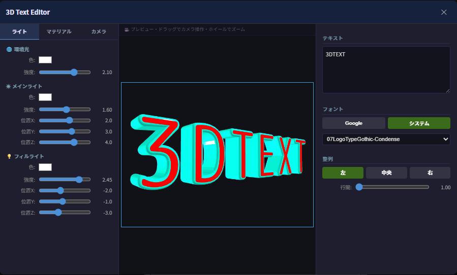
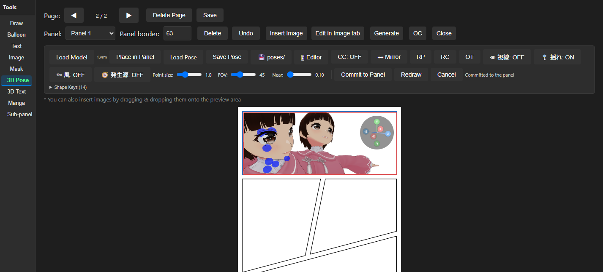
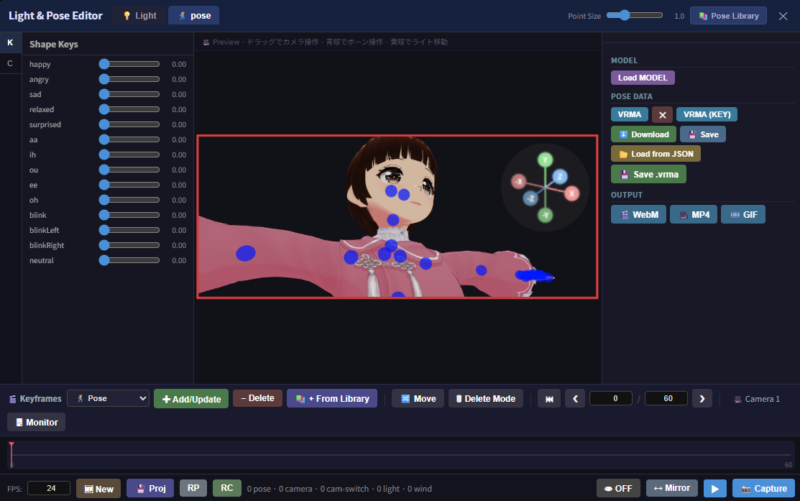

# ComfyUI Comic Creator

**English** | [日本語](README.md) | [中文](README_zh.md)

A manga page creation SPA (single-page application) that runs on top of ComfyUI. Pages are managed in units of "works" (page groups); you create pages from templates, place images, speech balloons, text, shapes, and 3D poses into panels, and export as JPEG/PNG/WebP/SVG/PDF/EPUB. A layer-based image editor, font manager, AI image generation (Nanobanana), and script management are all built in, aiming to cover the entire manga-making workflow from a single node.


## Features

### Page / Work management
- **Work (page group) management** — Pages are grouped into "works" that carry a width/height. Templates are automatically resized to the work's size when inserted
- **Templates** — Create panel-layout templates either by importing an SVG or with the wizard (draw lines to split the page into panels). SVG import works regardless of which drawing tool produced the file — Inkscape, Illustrator, Affinity Designer, CorelDraw, and others are all supported (`rect`/`path`/`polygon`/`polyline`/`circle`/`ellipse`, including nested groups and transforms), so you can just draw the panel borders visually and save. The SVG's `width` attribute (a real-world size with a unit) is used to automatically detect whether a scale correction is needed to match panel border widths with other templates, showing a confirmation dialog where you can review and adjust the multiplier if so (normalizes to the internal coordinate scale of "1 user unit = 0.01mm"). Templates assigned to a template group are shown under a collapsible group header in the Layout tab's "Templates" asset panel, making it easier to find the one you want as your template count grows. Turning on the wizard's "Design" checkbox lets you create a **design template** with no margin around the page and no gap between panels at all (for uses like flyer creation) — the frame width is forced to 0, and the panel border thickness can still be adjusted independently after placing the template on a page, via the Layout tab's "Panel Border Width". The **"Insert as Page"** button next to the group-filter dropdown at the top of the Page tab's "Templates" sub-tab also lets you insert the selected template as a new page into the work you currently have open (same operation as inserting from the Layout tab's "Template" asset panel)
- **Export** — Export as JPEG/PNG/WebP/SVG/PDF/EPUB, including bulk export of multiple pages with sequential filenames. The libraries (jsPDF/JSZip) are bundled, so every format also works offline
- **SVG export (re-editing in external software)** — Exports the page as vector data without rasterizing it, keeping text as real `<text>` elements, speech-balloon shapes as vector paths, and fonts self-contained via Base64 embedding. Confirmed to be nearly fully re-editable in Inkscape and Affinity Designer/Publisher. Adobe Illustrator breaks image links (requiring manual re-linking), making it impractical for real re-editing; CorelDraw hangs when loading the file and is unsupported
- **Automatic output size via resolution** — The "Resolution" selector (72–600dpi) calculates the output pixel size from the work size (mm); manual input is still available. PDF conversion uses the selected dpi, preserving the physical page size (A4, etc.)
- **Export metadata** — Embed title, author, subject, and keywords into every format (PDF = document properties / EPUB = Dublin Core / PNG = iTXt / JPEG & WebP = XMP). Resolution (dpi) is also always embedded (PNG = pHYs / JPEG = JFIF density / WebP = EXIF), so all three formats report the same dpi
- **Bulk backup / restore** — Save all works, pages, templates, and settings into a single zip and restore anytime (merge mode: same names are overwritten)

### Layout tab
- **Image placement** — Drag and drop images into a panel or the overlay (to target the overlay, either select "Overlay" in the layer panel first, or drop directly onto existing overlay content). Resize (aspect ratio locked by default, hold Alt to resize freely) and rotate with handles. The toolbar's **Delete** button isn't limited to images — it deletes whichever object is currently selected (balloon, text, shape, or group too), same as the Delete/Backspace key
- **Sub-panels** — Drag to add a rectangular or circular sub-panel inside a panel as a nested image target (e.g. an inset cut). Move, resize, and rotate with handles; parts that extend outside the parent panel are automatically cropped, just like any other object. Border thickness can be set per sub-panel. A "Move sub-panel" checkbox in the layer panel toggles whether clicking inside selects the sub-panel itself instead of the objects inside it. The layer panel's duplicate/move buttons also work on the sub-panel itself, including moving/duplicating it to another panel or to the overlay (re-parenting)
- **Speech balloons** — Place oval, rounded-rectangle, thought, burst, and cloud (puffy/wavy) shaped balloons inside panels, with 8-point resize handles. The **No tail** checkbox sets the tail length to 0 to hide it (unchecking restores the previous length). The burst shape has an **inner curve** slider that rounds the notch and flank between spikes while keeping the tips sharp. The **Embed Text** button lets you auto-wrap and embed text into any of these shapes (vertical writing, a line-height slider, text color, bold, a cross-axis position adjustment independent of the main alignment, Google/System/Category font selection, and double-click to re-edit an already-embedded text). Custom SVG balloons from assets can also have their fill/border colors changed after placement
- **Extension balloons** — Inspired by Comic Life's "extension balloon" feature. The **Add Extension** button adds a balloon of the same shape and color as the selected one, connected by a neck, so a long line of dialogue can be split across multiple balloons. Extensions can be individually repositioned, resized, rotated, and given their own embedded text. Moving the base also moves any extensions with it (resizing/rotating the base does not affect their position), while moving an extension only stretches the neck. Dragging the tail from the base toward an extension lets it reach the outer edge of the combined shape. Even where balloons overlap, no interior lines appear — only the outer outline of the whole connected group is shown
- **Text** — Vertical/horizontal writing, Google Fonts / system fonts, a style modal for fill, stroke, outline, shadow, line height, vertical alignment, and text alignment. The preview supports multiple lines; below Size, a line-height slider plus button-style vertical alignment (top/center/bottom) and text alignment (left/center/right) — the same controls as the balloon's embedded text — let you adjust and check multi-line text (in vertical writing, vertical alignment controls the position within each column, text alignment the left-right spread of the columns). Line height, vertical alignment, and text alignment are applied to the real text on both the Layout and Image tabs. Fills support gradients, textures (with adjustable X/Y position), and no-fill in addition to solid colors (shared between the Layout and Image tabs)
- **Shape drawing (Draw)** — Draw rectangles, ellipses, lines, curves, polygons, vector curves, chains, ropes, and My Curve directly onto an SVG layer. Polygons: click to add vertices, click near the start point to close. Vector curves: click to add nodes connected by a smooth spline, click near the start point to close as a filled shape, or press Enter to commit as an open line. Fills (rectangles, ellipses, polygons, vector curves, etc.) support gradients, textures (with configurable X/Y offset that follows the shape when moved or resized), and no-fill in addition to solid colors. Converting a shape to PNG preserves these fills as well
- **Paint tool** — A raster-brush painting feature, separate from vector shape drawing. Clicking "Add Paint" creates an image sized exactly to the selected panel/overlay/draft layer, selects it automatically, and turns Draw ON so you can start brushing right away (turning on the "Background" checkbox to its left fills it with an opaque color instead of full transparency, avoiding black backgrounds when sent to I2I). The brush works on any selected regular image too, not just newly added paint objects. Supports brush color, opacity, and size (slider), plus x5 (5x brush size) and eraser toggles whose ON/OFF state is shown by button color. **With a pen tablet, brush size and opacity automatically change with pen pressure** (mouse operation keeps the fixed size and opacity as before). Paint objects appear in the layer panel with a 🖌 icon and the name "Paint" to distinguish them from regular images. The "Merge Selected" button composites 2+ checked images/paint layers in the layer panel into a single PNG (preserving stacking order and rotation), useful for sending multiple layers combined to I2I. Useful for rough sketches to edit in the Image tab, or for creating I2I reference images
- **Mask tool** — Add multiple mask layers to a panel, overlay, or individual object (image, balloon, text, shape, or group), of two types — hide and show — stacked and composited together. Adjust the brush (paint/erase), size, and hardness while painting, with an optional semi-transparent red preview of the hidden area. Supports bulk invert/clear/fill-all operations and per-layer temporary enable/disable. **With a pen tablet, brush size automatically changes with pen pressure** (mouse operation keeps the fixed size as before)
- **3D pose** — Place a VRM/GLB/GLTF model inside a panel, pose it, and bake it into the image. Supports a draggable LookAt target, spring bone (hair/skirt) physics, and a breeze wind effect with a draggable wind-direction marker. Toolbar sliders adjust the camera's **FOV (10–120°) and Near clip plane (0.01–5)**. The **🎛 Editor** button opens the "Light & Pose Editor" (always starts on the Pose tab; switch between 💡Light/🕺pose at the top): the Pose tab has shape keys, a 📚 Pose Library (pick a .json/.vroidpose/.vrma pose from the `poses/` folder's thumbnails and apply it instantly; .vrma files can be previewed in a mini player and imported onto the keyframe timeline with "🔑 Load KEY"), and a keyframe timeline (switch Pose/Camera/Light/Wind tracks, scrub to any frame with the playback bar, then click "📸 Capture" to commit that exact frame's pose straight into the panel); the Light tab manages multiple lights (Sun/Point/Spot/Box/Ambient), the Ground/BG Wall, and saved presets (via [comfyui-vrm-pose-editor](#optional-dependencies))
- **3D text** — Extrude text (including Japanese), or the vector paths of an SVG file, into 3D using Three.js and bake it into the image ("Text" / "SVG" mode switch). Supports TrueType Collection (.ttc) fonts, common among Windows CJK system fonts (Yu Gothic, Meiryo, etc.). Choose between a Standard material (metalness/roughness) or Toon (MToon-compatible shading), and **set the front-face and side-face colors independently** (a separate material is applied to the geometry's front/back cap faces versus its extruded side faces). The **⚙ 3D Settings (3D Text Editor)** modal has a 3-column layout: a tab switcher for Light / Material / Camera on the left, a live preview embedded directly inside the modal in the center, and an always-visible Text panel (content, font, alignment, line height) on the right. Bevel thickness, size, and segment count can also be fine-tuned, and are automatically disabled with a warning if too large for the shape. Zoom control mode and enhanced antialiasing are shared with the 3D Pose light editor (via [comfyui-vrm-pose-editor](#optional-dependencies))
- **Groups and layer panel** — Group objects, manage stacking order, toggle visibility, lock, and **delete with the Delete / Backspace key**
- **Draft layer** — A draft-only layer that sits in front of the overlay and covers the whole page (images only). Clicks only reach it while it's selected (edit mode); otherwise clicks pass straight through to the overlay/panels/objects below. Never included in output (JPEG/PNG/WebP/SVG/PDF/EPUB). The Image tab's "Draft" button creates a canvas at the same aspect ratio as the active work at 72dpi, and the "Layout" button automatically inserts it into this layer at full page size
- **Generate integration** (formerly I2I integration) — The "Generate" button opens a modal where you switch between three targets — a selected image, the whole page, or a single panel (picked via the prompt tabs) — and run I2I/T2I generation via Workflow Studio on the spot. Prompts are split into an "Overall" tab plus one "Panel N" tab per panel on the current page, each with its own independent Positive/Negative. A **batch** checkbox appears only when the target is the whole page: on, it batch-generates every panel on the current page (combining the "Overall" tab prompt with each panel tab's prompt) and replaces each panel's image in turn; off, it keeps the previous behavior of compositing the whole page into one flat image and always inserting the result into the overlay at full page size (for rough previews). A **T2I** checkbox next to the Run button switches to generating from text only, without an input image (the Denoise field is hidden while it's on). Default workflows to auto-load can be configured independently for I2I and T2I in the modal's collapsible "Workflow Settings" section (the I2I setting is shared with the I2I panel of the Image tab's Select tool, via [ComfyUI-Workflow-Studio](#optional-dependencies))
- **PixiJS FX** — Apply particle/filter effects to the selected image from the "Image" sub-tab (via [comfyUI-particle-pixijs](#optional-dependencies))
- **Manga tool** — "Halftone" (an "Convert image" mode that halftones the selected image, plus a "Create pattern" mode that generates a halftone dot pattern sized to the panel/overlay), "Manga effects" (generate and insert vignette, screentone noise, and speed lines — radial / uni flash / uni ring / linear — as transparent objects sized to the panel), and "Background Pattern" (generate stripes, dots, checks, Japanese traditional motifs — asanoha/ichimatsu/shippou/uroko — or a custom SVG as a transparent object sized to the panel; adjustable color, opacity, size, and rotation angle, with independent width/height for custom SVGs). All three modals let you switch the preview background between the selected image, a checkerboard, and white while adjusting

### Image tab (layer-based Canvas 2D editor)
- **Select / Text / 3D Text / Draw / Shape / Fill / Mask / Blur / Filter / BG Remove / Upscale** tools (the Select tool now displays selection bounds and transform handles for objects outside the canvas via an extended control overlay, and draws a real checkerboard pattern on transparent areas to clearly indicate canvas boundaries; 3D Text shares the same engine and settings modal as the Layout tab, via [comfyui-vrm-pose-editor](#optional-dependencies))
- **Crop (in the Select tool)** — Set the crop area by dragging a resizable overlay (8 handles) or entering X/Y/width/height numerically, then apply. Resizes the whole canvas and shifts each layer's content to match (undoable)
- **Select I2I** — While the Select tool is active, an always-visible I2I panel lets you set Positive/Negative prompts and Denoise and click Run to execute a Workflow Studio I2I generation on the spot. Switch the target between "All" (all layers composited) and "Layer" (only the selected layer); the result is added as a new layer that inherits the original layer's position, size, and rotation (via [ComfyUI-Workflow-Studio](#optional-dependencies))
- **Draft canvas creation** — The "Draft" button (next to New) creates a new canvas with no size dialog, sized at the same aspect ratio as the active work at 72dpi (for rough sketches). The "Layout" button inserts it into the Layout tab's draft layer at full page size
- **PSD (Photoshop) support** — "Open PSD" loads a PSD file together with its layer structure (opacity, blend mode, and visibility are restored too; it always starts as a new document rather than merging with existing work). The "PSD" save button exports the layer composition as a PSD file (since PSD cannot represent an adjustment layer as an independent layer, its effect is baked into the nearest visible layer beneath it before export)
- **Action bar: Save / Send to** — Organized into Save (PNG / PSD / Project / Gallery) and Send to (Eagle / wsI2I / LI Node / Layout). **wsI2I** is the former "Send to I2I" (sends to Workflow Studio's Generate UI Image input slot); **LI Node** is a new feature that sends the composited result directly into the image widget of the node currently selected on the ComfyUI canvas (e.g. Load Image) — only available when opened from ComfyUI's "CC" button, via the same mechanism as [ComfyUI-Workflow-Studio](#optional-dependencies)'s "Send to Workflow"
- **Eyedropper for the Draw tool** — Pick a color directly from the canvas via the button next to the color picker. **With a pen tablet, brush size and opacity automatically change with pen pressure** (mouse operation keeps the fixed size and opacity as before)
- **Same Layer mode for the Shape tool** — Keep adding shapes to the same layer instead of creating a new one for every shape. Rectangle/ellipse fills support gradients and textures (with adjustable X/Y position) in addition to solid colors
- **Fill tool** — Solid color fill, or linear/radial gradient fill with a color ramp and direction pad
- **Mask tool** — Paint/Color/Alpha/Text/Vector/Shape sub-tools, also supporting SAM3 segmentation and ABR brushes (tool set implemented with reference to [comfyui-mask-editor-one](#acknowledgements)). The Paint sub-tool's brush size **automatically changes with pen tablet pressure** (mouse operation keeps the fixed size as before). When Workflow Studio is installed, an **Inpaint** button is added to the sub-tool bar for mask + prompt-based generative inpainting (via [ComfyUI-Workflow-Studio](#optional-dependencies))
- **PixiJS FX** — Apply particle/filter effects to the active layer from a toolbar button (via [comfyUI-particle-pixijs](#optional-dependencies))
- **Layer panel** — Add, duplicate, delete, reorder, adjust opacity, and 12 kinds of adjustment layers (brightness, contrast, saturation, etc.). Multi-select layers and click **Merge** to combine only the selected ones (merging mask layers together keeps the result as a mask layer). The **📁 Group** button on the toolbar's second row folds multi-selected layers into a collapsible group folder (with bulk show/hide and ungroup, undoable)
- **Project saving** — Save the entire layer composition and resume editing at any time

### Font manager
- Preview Google Fonts and system fonts, with category management
- Create and save "Styles" (fill, stroke, outline, shadow, line height, vertical alignment, text alignment — the same button-style controls as the balloon's embedded text, applied to the real text on both the Layout and Image tabs) and "Presets" (font + size + style), and apply them instantly from the Layout / Image tabs

### Nanobanana (AI image generation)
- Generate images via the Gemini API (Positive/Negative prompts, model, and resolution)
- Generated images are automatically saved to ComfyUI's own `output/cc_nanobanana` folder

### Script tab
- Manage the screenplay in a hierarchy of Title → Synopsis → Plot [Pages → Panel breakdown (scene, image prompt, elements, dialogue/description, etc.)]
- Insert any plot cell's content into the Layout tab as text with one click
- **Media type (Manga / Semi-Auto Manga / Novel / Screenplay)** — a sub-tab foundation for switching the editing screen per work (fixed per work). "Manga" and "Semi-Auto Manga" share the same panel-breakdown editing screen while keeping each work's data separate (Novel and Screenplay are planned)
- **Semi-automatic manga creation** — the "Map this page to the layout" button maps each panel of a template-applied Layout-tab page to the script's panels in panel-number order. The "Get from Layout" button matches this page's panel count to the actual panel count of the currently selected Layout-tab page (shows a confirmation dialog if panels with entered data would be removed). The plot table has a per-line "Balloon Shape" dropdown (Default / Normal / Rounded rectangle / Thought / Bomb / Cloud (puffy) / Cloud (wavy)); the "Auto-generate balloons" button then automatically creates dialogue-filled balloons in the shape specified per line (rounded rectangle by default) in each mapped panel (adjustable afterward with the existing manual editing tools). The "L" button adds Workflow Studio-based prompt drafting (Ollama/LM Studio). The "Batch-generate images (T2I)" button opens a dedicated modal with the same layout as "Batch-generate images (I2I)" (overall Positive/Negative combined with each panel's prompt, an option to skip panels with an empty prompt, and a T2I default-workflow setting) to run batch T2I image generation sized to each panel's aspect ratio. The "Batch-generate images (I2I)" button opens a dedicated modal equivalent to the Layout tab's I2I modal (overall Positive/Negative combined with each panel's prompt, with an option to skip panels that have an empty prompt) and runs batch I2I generation using each panel's current image as input. The "Batch-generate images (Nanobanana)" button uses Nanobanana (the Gemini image generation API) instead of Workflow Studio, automatically picking the closest Nanobanana resolution preset to each panel bounding box aspect ratio and scaling the result on insert (with model selection and a "2K" toggle; generated images follow the Eagle auto-save setting). The same "2K" toggle was added to the Nanobanana tab (sets the Gemini API's ImageConfig.imageSize, supported models only). Since the Gemini image generation API has no numeric parameter for controlling I2I edit intensity, the previous I2I strength slider was removed from both the Nanobanana tab and the semi-automatic manga modal

### External integrations
- **Workflow Studio** — Embedded gallery view, bidirectional I2I (image ↔ workflow) transfer
- **Eagle** — Save generated/edited images to Eagle automatically or manually
- **G'MIC** — Filter editing integrated with the G'MIC Qt GUI

### Other
- **Multilingual UI (i18n)** — Switch between Japanese, English, and Chinese in the Settings tab (the entire Help tab is also available in all three languages)
- **Help tab** — A searchable, comprehensive in-app reference covering every feature

## Installation

### Manual installation

Place this folder inside ComfyUI's `custom_nodes/` directory:

```
ComfyUI/
└── custom_nodes/
    └── comfyui-comic-creator/
        ├── __init__.py
        ├── py/
        ├── templates/
        ├── static/
        ├── web/
        └── assets/
```

The core features require no additional Python packages (`aiohttp` / `Pillow` are already bundled with ComfyUI itself). The Image tab's PSD (Photoshop) support is the only feature that uses `psd-tools`, which is listed in `requirements.txt` and therefore installed automatically by ComfyUI Manager and similar installers (other features are unaffected if it's missing).

After restarting ComfyUI, a **CC** button appears in the top bar. Click it to open Comic Creator (`/ccc`) in a new tab.


### ComfyUI Manager

You can install it via ComfyUI Manager's "Install via Git URL" using the following URL:

```
https://github.com/ketle-man/comfyui-comic-creator
```

## Optional setup

### To use Nanobanana (Gemini API)

Create a `.env` file directly under this folder and add your Gemini API key:

```
NANOBANANA_API_KEY=your-api-key
```

Restart ComfyUI after saving.

### To use G'MIC

In the Settings tab's "G'MIC Settings", specify the full path to the G'MIC Qt executable (`gmic_qt.exe`). It takes effect immediately after saving — no ComfyUI restart required.

### To use Eagle integration

In the Settings tab's "Eagle Settings", check/change the Eagle API URL (default: `http://localhost:41595`). The Eagle app must be running.

### Optional dependencies

Installing the following custom nodes enables the corresponding features. Nothing else is affected if they are not installed.

| Companion node | Feature enabled |
|---|---|
| **comfyui-vrm-pose-editor** | 3D Pose / 3D Text in the Layout tab and the Image tab |
| **ComfyUI-Workflow-Studio** | I2I integration, Inpaint in the Image tab, and the embedded gallery in the workflow studio tab |
| **comfyUI-particle-pixijs** | PixiJS FX (particle/filter effects modal) in the Layout tab's "Image" sub-tab and the Image tab |

## Usage

1. Open Comic Creator via the **CC** button in the top bar
2. In the "Page" tab's "Work Management", enter a work name and size, then click "New" (this automatically switches to the Layout tab)
3. Choose a template from the "Template" asset panel on the left of the Layout tab and click "Insert as Page"
4. Place and edit images, speech balloons, and text in the panels, then click "Save"
5. Repeat page navigation (◀▶) and template insertion to create multiple pages
6. In the "Page" tab's "Export", specify the format and range, then save

See the in-app **Help** tab (available in Japanese, English, and Chinese, with search) for full documentation.

## Screenshots

<p>
  
  
  
</p>
<p>
  
  
  
</p>
<p>
  
  
</p>
<p>
  
  
</p>
<p>
  
  
</p>
<p>
  
  
</p>
<p>
  
  
</p>

## Architecture

```
comfyui-comic-creator/
├── __init__.py              # ComfyUI extension entry point (WEB_DIRECTORY, route registration)
├── py/
│   ├── ccc.py                 # aiohttp route handlers
│   └── config.py              # Path/constant definitions
├── templates/
│   └── index.html             # SPA body (static HTML with data-i18n attributes)
├── static/
│   ├── js/
│   │   ├── main/                # main.js split files (state management, per-tab logic)
│   │   ├── image-tab.js         # Image tab controller
│   │   ├── image-tab/           # Image-tab-specific tools (DrawTool/ShapeTool/FillTool/MaskTool, etc.)
│   │   ├── i18n.js              # Multilingual dictionary (ja/en/zh) + t()
│   │   ├── nanobanana.js        # Nanobanana (Gemini API) integration
│   │   ├── pixifx.js            # PixiJS FX integration
│   │   └── vendor/              # Bundled libraries (jsPDF/JSZip, for offline use)
│   └── css/
├── web/comfyui/
│   └── ccc_menu.js             # Registers the launch button in the ComfyUI top bar
├── assets/                     # Bundled templates, balloons, and other assets
└── docs/                       # Screenshots for the README
```

### API endpoints (excerpt)

| Method | Path | Purpose |
|----------|------|------|
| GET | `/ccc` | SPA entry point |
| GET | `/api/ccc/refresh-assets` | Regenerate the asset list |
| POST | `/api/ccc/nanobanana/generate` | Generate a Nanobanana image |
| POST | `/api/ccc/save-image-project` | Save an Image tab project |
| POST | `/api/ccc/eagle/add` | Save an image to Eagle |
| POST | `/api/ccc/local-gmic/open_in_gui_b64` | Launch the G'MIC Qt GUI |
| GET | `/api/ccc/local-gmic/status/{job_id}` | Get a G'MIC job's status |

## License

MIT License — see [LICENSE](LICENSE) for details.

## Acknowledgements

- **[comfyui-vrm-pose-editor](https://github.com/ketle-man/comfyui-vrm-pose-editor)** — Companion node providing the 3D pose editing feature, and the Three.js resources (renderer, MToon material, etc.) used by the 3D text feature
- **[ComfyUI-Workflow-Studio](https://github.com/ketle-man/ComfyUI-Workflow-Studio)** — Companion node providing I2I integration and the embedded gallery
- **[comfyUI-particle-pixijs](https://github.com/ketle-man/comfyUI-particle-pixijs)** — Companion node providing the PixiJS FX (particle/filter effects) feature
- **[comfyui-mask-editor-one](https://github.com/ketle-man/comfyui-mask-editor-one)** — Node referenced when implementing the Image tab's Mask tool and layer mechanism
- [G'MIC](https://gmic.eu/) — Filter editing (via the G'MIC Qt GUI, an external executable)
